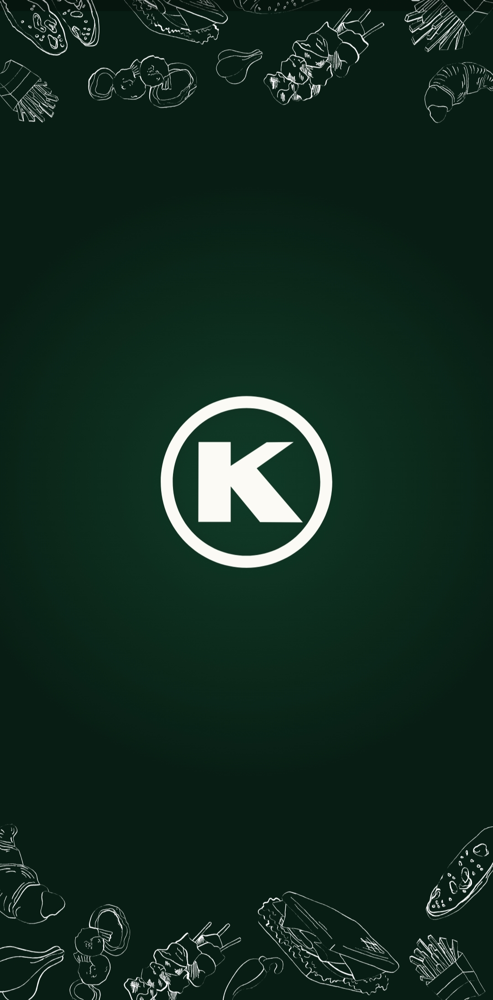
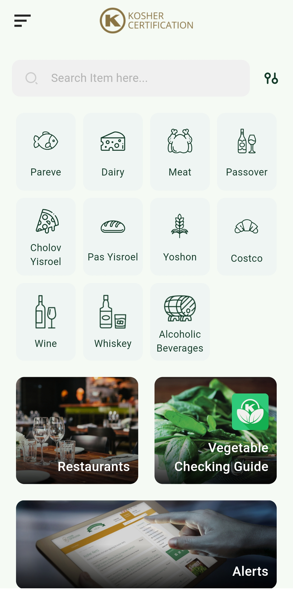
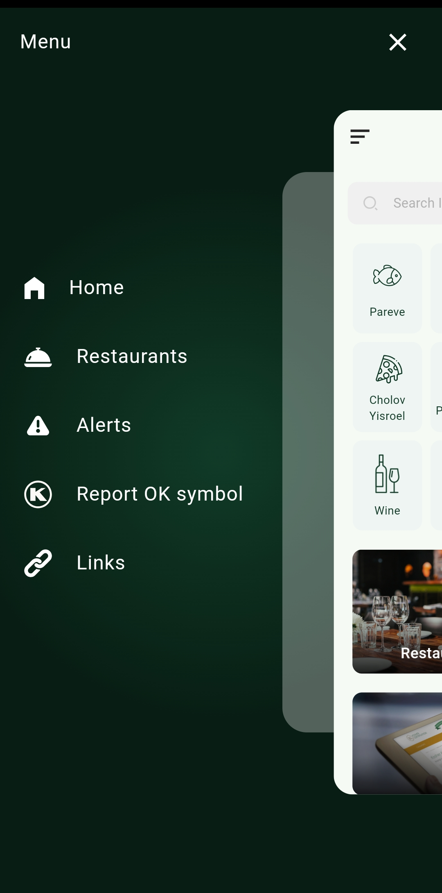
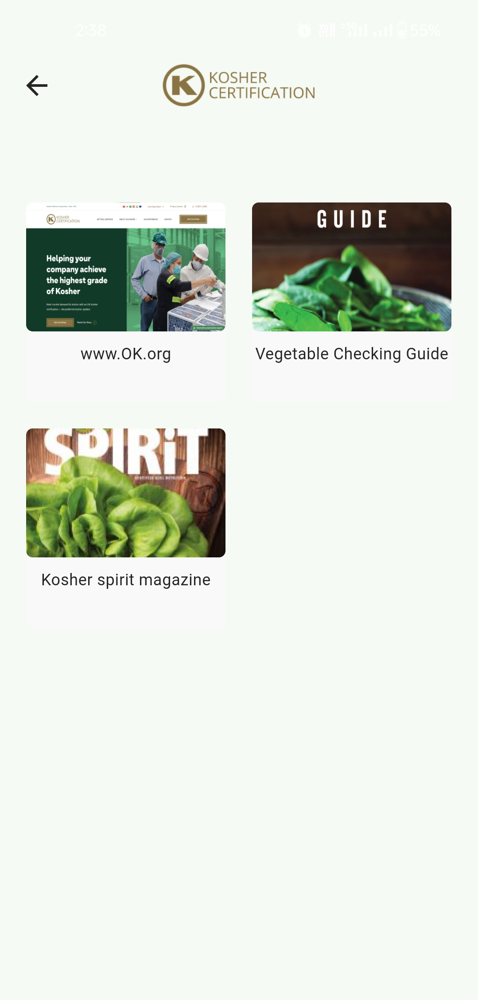
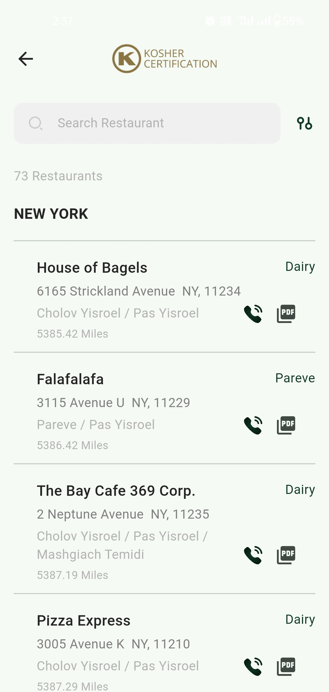
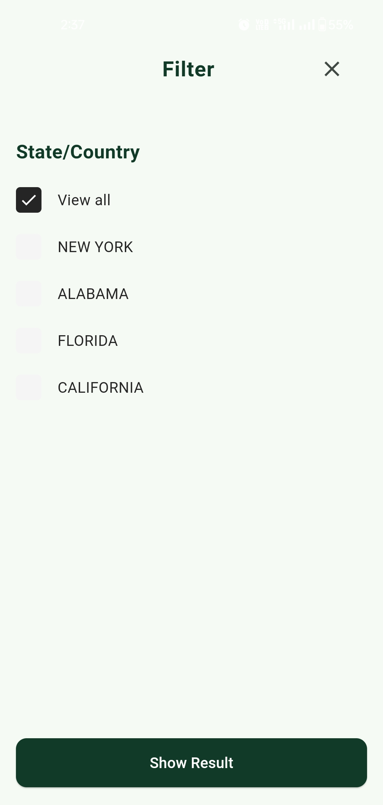
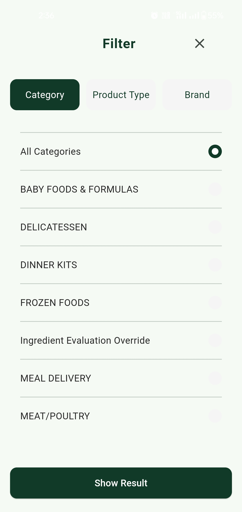
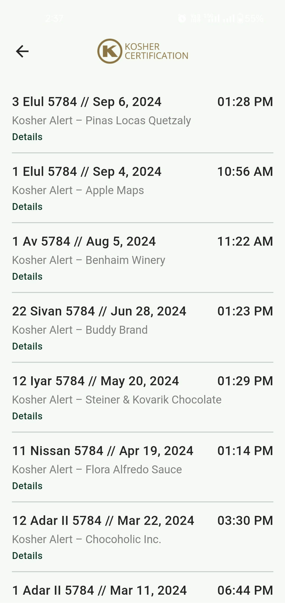
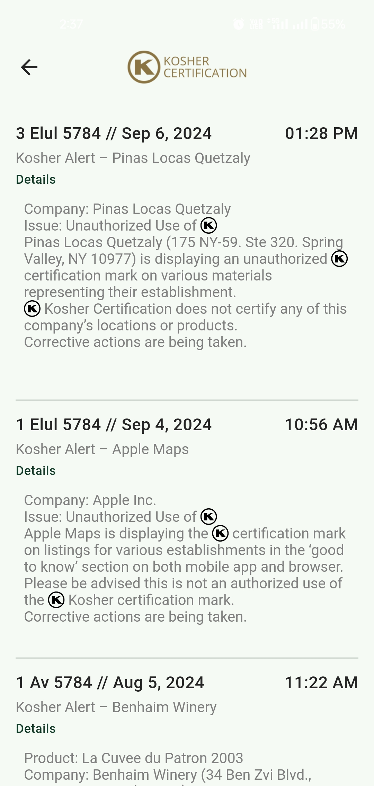

# KosherDirect

The **KosherDirect** app provides users with a comprehensive and up-to-date database of kosher-certified products, powered by OK Kosher Certification. With options to search by company or category, KosherDirect helps users access reliable kosher information anytime, whether at home, on the go, or in the supermarket.

[](https://2ly.link/1zkKj)
[](https://2ly.link/1zkKV) 

## Table of Contents

- [Project Overview](#project-overview)
- [Features](#features)
- [Getting Started](#getting-started)
- [Prerequisites](#prerequisites)
- [Installation](#installation)
- [Usage](#usage)
- [Technologies Used](#technologies-used)
- [Contact](#contact)

## Project Overview

KosherDirect makes it easy to verify kosher certifications with a streamlined, user-friendly interface. The app enables users to browse and search for certified kosher products, simplifying kosher compliance for everyday life.

### Play Store Link

The app is available on the Google Play Store: [KosherDirect](https://play.google.com/store/apps/details?id=com.okkosher.foodguide)
### Screen shorts
<div >
  <table>
    <tr>
      <td></td>
      <td></td>
      <td></td>
    </tr>
   <tr>
      <td></td>
      <td></td>
      <td></td>
    </tr>
   <tr>
      <td></td>
      <td></td>
      <td></td>
    </tr>
  </table>
</div>

## Features

- **Detailed Search Options**: Search by company name or product category.
- **Current Kosher Certifications**: Access the latest certification details for a variety of products.
- **Mobile Accessibility**: Designed for a seamless experience across devices.
- **Offline Caching**: Limited access to recent searches when offline.

## Getting Started

Follow these steps to run KosherDirect locally or to make modifications.

### Prerequisites

- [Flutter SDK](https://flutter.dev/docs/get-started/install)
- Android Studio or Visual Studio Code (with Flutter and Dart plugins)
- [Git](https://git-scm.com/)

### Installation

1. Clone this repository:

    ```bash
    git clone https://github.com/yourusername/kosherdirect.git
    cd kosherdirect
    ```

2. Install dependencies:

    ```bash
    flutter pub get
    ```

3. Connect your device or open an emulator.

4. Run the app:

    ```bash
    flutter run
    ```

## Usage

Once launched, use the search functionality to locate kosher products by company or category. KosherDirect provides all essential information certified by OK Kosher Certification.

## Technologies Used

- **Flutter**: Cross-platform framework for mobile development.
- **Dart**: Language for Flutter.
- **Firebase**: For backend services, data storage, and in-app purchases (if applicable).

## Contact

For further assistance or inquiries:

- **Developer**: [Your Name]
- **Email**: [Your Email]
- **GitHub**: [Your GitHub Profile Link]

---

Thank you for choosing KosherDirect!
